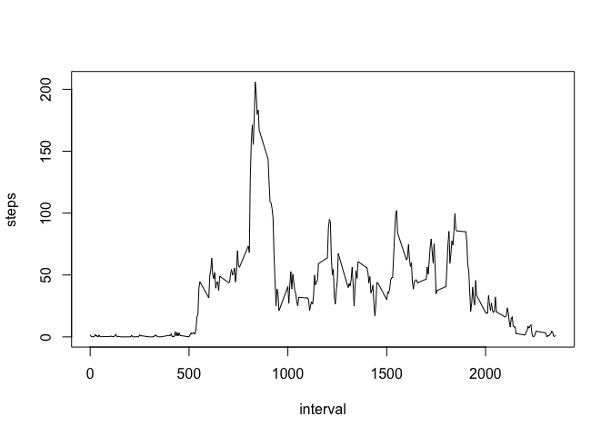

# Reproducible Research: Peer Assessment 1


Analysis of Ativity monitoring data
===================================

by Gleb Pishchany  
for  

#Reproducible Research Course  
  
 
        
          
            

## Loading and preprocessing the data

First, I will download the file from here, and unzip it:  
[Activity monitoring data](https://d396qusza40orc.cloudfront.net/repdata%2Fdata%2Factivity.zip)


```r
url<-'https://d396qusza40orc.cloudfront.net/repdata%2Fdata%2Factivity.zip'
download.file(url, dest='activity.zip', method='curl')
unzip('activity.zip')
```

Now let's load the resulting .csv file into R and take a look at it:


```r
activity<-read.csv('activity.csv')
head(activity)
```

```
##   steps       date interval
## 1    NA 2012-10-01        0
## 2    NA 2012-10-01        5
## 3    NA 2012-10-01       10
## 4    NA 2012-10-01       15
## 5    NA 2012-10-01       20
## 6    NA 2012-10-01       25
```

Right away I want to take a closer look at some of the variables:


```r
str(activity)
```

```
## 'data.frame':	17568 obs. of  3 variables:
##  $ steps   : int  NA NA NA NA NA NA NA NA NA NA ...
##  $ date    : Factor w/ 61 levels "2012-10-01","2012-10-02",..: 1 1 1 1 1 1 1 1 1 1 ...
##  $ interval: int  0 5 10 15 20 25 30 35 40 45 ...
```

I'll go ahead and change the format of the date variable to make analysis easier later on:


```r
activity$date<-as.Date(as.character(activity$date), '%Y-%m-%d')
summary(activity$date)
```

```
##         Min.      1st Qu.       Median         Mean      3rd Qu. 
## "2012-10-01" "2012-10-16" "2012-10-31" "2012-10-31" "2012-11-15" 
##         Max. 
## "2012-11-30"
```

That looks good, we can see now that we have data acquired between Oct. 1 and Nov.30 (min and max values)       
  
      

## What is mean total number of steps taken per day?

Note that it you need to first run the part one before running this one.

First, let's calculate the total number of days recorded each day. I will use dplyr package to 1) Separate the data by date, and 2) calculate the total number of steps for each day


```r
library(dplyr)
```

```
## 
## Attaching package: 'dplyr'
## 
## The following object is masked from 'package:stats':
## 
##     filter
## 
## The following objects are masked from 'package:base':
## 
##     intersect, setdiff, setequal, union
```


```r
activity_by_date<-group_by(activity, date)
daily_steps<-summarize(activity_by_date, steps=sum(steps))
daily_steps
```

```
## Source: local data frame [61 x 2]
## 
##          date steps
## 1  2012-10-01    NA
## 2  2012-10-02   126
## 3  2012-10-03 11352
## 4  2012-10-04 12116
## 5  2012-10-05 13294
## 6  2012-10-06 15420
## 7  2012-10-07 11015
## 8  2012-10-08    NA
## 9  2012-10-09 12811
## 10 2012-10-10  9900
## ..        ...   ...
```
Only 126 steps on Oct, 2nd? Must have had a cold and stayed home playing video games.  

Next we make a histogram and calculate the stats for steps taken each day:


```r
hist(daily_steps$steps, main='Steps per day', ylab='Number of Days', xlab='Steps')
```

 

```r
summary(daily_steps$steps)
```

```
##    Min. 1st Qu.  Median    Mean 3rd Qu.    Max.    NA's 
##      41    8841   10760   10770   13290   21190       8
```

The mean is 10760 and the median is 10770.

## What is the average daily activity pattern?

So here, something is wrong with the data. There's a right number of intervals (12 five-minute intervals per hour times 24 hours=288 each day). The total number of observations is 288 X 61 days=17568. However, for some reason they break continuity in intervals between 60-95, 160-195 and so on. As a result the plot that would be generated from the data is not accurate. Here it is:

```r
activity_by_interval<-group_by(activity, interval)
steps_by_interval<-summarize(activity_by_interval, steps=mean(steps, na.rm=T))
with(steps_by_interval, plot(interval, steps, type='l'))
```

 

So when did he walk the most?


```r
steps_by_interval[steps_by_interval$steps==max(steps_by_interval$steps),]
```

```
## Source: local data frame [1 x 2]
## 
##   interval    steps
## 1      835 206.1698
```

See what's wrong with the graph btw? There are only 1440 minutes in 24 hours!

I am going to fix that!

First, let's make a vector with intervals that are properly numbered.  


```r
activity$cor_int<-rep(seq(0, 1435, by=5), times=61)
```

Now, let's make the graph, I will convert minutes to hours, because that makes more sense (I don't know, maybe you think of your days in terms of minutes, but I don't).  
Also, no one takes 14.6 steps, so I will round the numbers.


```r
activity_by_cor_int<-group_by(activity, cor_int)
steps_by_cor_int<-summarize(activity_by_cor_int, ave_steps=round(mean(steps, na.rm=T)))
with(steps_by_cor_int, plot(cor_int/60, ave_steps, type='l', xlab='hour', main='Average Steps Taken in a 24 hour cycle'))
```

 

Early to bed, early to rise! That's more like it.


```r
most_steps<-steps_by_cor_int[steps_by_cor_int$ave_steps==max(steps_by_cor_int$ave_steps,na.rm=T),]
most_steps
```

```
## Source: local data frame [1 x 2]
## 
##   cor_int ave_steps
## 1     515       206
```

And to make it more human-readable:


```r
most_steps[1]/60
```

```
##    cor_int
## 1 8.583333
```

Boom! This dude is really working it at around 8:30 am!

## Imputing missing values

OK. No one is perfect. Even a pedometer. Or maybe sometimes you just take it off, like when you do something else that's rhythmical and is not walking ;)

Let's see how much that happened:


```r
colSums(is.na(activity))
```

```
##    steps     date interval  cor_int 
##     2304        0        0        0
```

2304!!! That's a lot of 'NA' activity for one person! Maybe it's Batman and he does not want us to know that so he takes of the pedoemeter when chasing criminals. OK. Now we will replace the NA values. I'm calling BS on that, so I will call the resulting table appropriatly.
  
I will replace the missing values with an average for that interval throughout the two months.  
  
First, I will merge 'activity' data frame with steps_by_cor_int such that I create a variable in each row with an average for that interval.

```r
BS_activity<-merge(activity, steps_by_cor_int, by='cor_int', sort=F)
```

Now, I will run this loop that will look for missing values (steps, in column two) and replace them with average values for that interval (ave_steps, in column five).


```r
for (i in seq_along(BS_activity$steps)){
        if (is.na(BS_activity[i,2])){
                BS_activity[i,2]=BS_activity[i,5]
        }
        else{
                next
        }
}
```

Once again, let's count the total steps.


```r
bs_activity_by_date<-group_by(BS_activity, date)
bs_daily_steps<-summarize(bs_activity_by_date, steps=sum(steps))
bs_daily_steps
```

```
## Source: local data frame [61 x 2]
## 
##          date steps
## 1  2012-10-01 10762
## 2  2012-10-02   126
## 3  2012-10-03 11352
## 4  2012-10-04 12116
## 5  2012-10-05 13294
## 6  2012-10-06 15420
## 7  2012-10-07 11015
## 8  2012-10-08 10762
## 9  2012-10-09 12811
## 10 2012-10-10  9900
## ..        ...   ...
```

OK. So now lets look at the histograms.


```r
par(mfrow=c(1,2))
hist(daily_steps$steps, main='Steps per day', ylab='Number of Days', xlab='Steps', ylim=c(0,35))
hist(bs_daily_steps$steps, main='Steps per day (imputed)', ylab='Number of Days', xlab='Steps', ylim=c(0,35))
```

 

They do look a bit different, don't they?  

OK. Let's see if the mean and median are different.


```r
summary(daily_steps$steps)
```

```
##    Min. 1st Qu.  Median    Mean 3rd Qu.    Max.    NA's 
##      41    8841   10760   10770   13290   21190       8
```

```r
summary(bs_daily_steps$steps)
```

```
##    Min. 1st Qu.  Median    Mean 3rd Qu.    Max. 
##      41    9819   10760   10770   12810   21190
```

That looks pretty amazing. Notice the difference in the spread of the data (1st and 3rd quantile), but median and mean are the same. Nice.

## Are there differences in activity patterns between weekdays and weekends?

I am running out of time here, so real quick:

Make a weekday variable


```r
BS_activity<-mutate(BS_activity, day=weekdays(date))
```


Create a weekend/weekday vector and cbind it.

```r
day_end<-vector()
for (i in seq_along(BS_activity$date)){
        if (BS_activity[i,6]=='Saturday'){
                day_end[i]<-'Weekend'
        }
        else if ((BS_activity[i,6]=='Sunday'))
                day_end[i]<-'Weekend' 
        else{
                day_end[i]<-'Weekday'
        }
}
BS_activity<-cbind(BS_activity, day_end)
head(BS_activity)
```

```
##   cor_int steps       date interval ave_steps      day day_end
## 1       0     2 2012-10-01        0         2   Monday Weekday
## 2       0     0 2012-11-23        0         2   Friday Weekday
## 3       0     0 2012-10-28        0         2   Sunday Weekend
## 4       0     0 2012-11-06        0         2  Tuesday Weekday
## 5       0     0 2012-11-24        0         2 Saturday Weekend
## 6       0     0 2012-11-15        0         2 Thursday Weekday
```

Split the data and calculate the means for each interval on weekends and weekdays separately.

```r
by_day<-group_by(BS_activity, day_end, cor_int)
mean_by_day_and_interval<-summarize(by_day, ave_steps=round(mean(steps, na.rm=T)))
```

Now make the graph! He sleeps in on weekends!

```r
with(mean_by_day_and_interval, plot(cor_int/60, ave_steps, type='l', xlab='hour', ylab='steps', main='Average Steps Taken Throughout the Day'))
with(subset(mean_by_day_and_interval, day_end=='Weekend'), lines(cor_int/60, ave_steps, col='red'))
legend('topleft', col=c('black', 'red'), pch=20, legend=c('Weekday', 'Weekend'))
```

 
